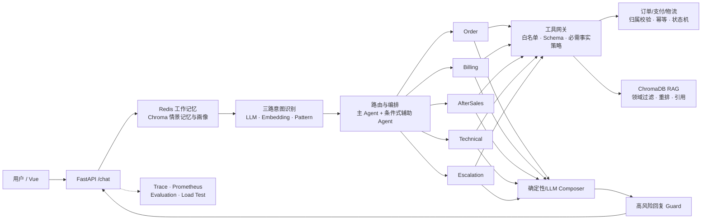

# CommerceMind

> 面向电商售后的可靠 Multi-Agent 决策与工具执行系统：让模型负责理解和表达，让代码负责权限、事实与交易安全。

[](https://www.python.org/)
[](https://fastapi.tiangolo.com/)
[](#验证结果)
[](docs/unified_benchmark_v1.md)
[](LICENSE)

CommerceMind 不是“LLM + 聊天页面”的演示。它围绕 Agent 应用落地最容易出问题的四个环节构建：**混合意图路由、多 Agent 编排、代码级工具治理、可观测降级**。系统接入订单、物流、支付和退款事实，并用确认状态机、归属校验与幂等约束资金类操作。

## 一分钟看懂

| 问题 | 方案 | 可验证证据 |
|---|---|---|
| 单一路由易受模型波动影响 | LLM + Embedding + Pattern 三路融合，支持细粒度意图修正 | 70 条意图集 Accuracy 92.86%，Macro-F1 90.04% |
| 单 Agent 工具过多、权限过大 | 按领域拆分 Agent，代码层白名单与 Schema 双重校验 | 36/36 工具与交易安全断言通过 |
| 多领域请求容易漏处理 | 主 Agent + 条件式辅助 Agent 并发执行 | 32 条编排集 Exact Match 87.50%，Micro-F1 95.83% |
| RAG 可能召回错域知识 | 查询扩展、领域过滤、重排与拒答 | Hit@3 78.95%，MRR 0.763，拒答准确率 100% |
| 模型超时拖垮整条链路 | Agent 总时间预算，保留只读工具事实并确定性降级 | 1 秒故障注入约 1.04 秒返回，事实工具仍保留 |
| 系统能跑但不可定位 | 请求级 Trace、阶段耗时、模型 usage、Monitor/Evaluation 分离 | `/chat` 返回阶段耗时、降级 Agent 与 token 用量 |

完整的 160 条统一评测及错误样本见[统一评测报告](docs/unified_benchmark_v1.md)。这些是仓库内合成数据，不代表生产流量准确率。

## 架构



```text
记忆读取 → 三路意图识别 → 条件路由 → Agent 并发执行
→ 受控工具/RAG → 回复整合 → Guard → 记忆写回 → Trace
```

## 关键设计

### 混合意图识别

- LLM 处理口语、省略和复杂语义；其 `confidence` 是模型自评分，不冒充校准概率。
- Embedding 提供语义相似证据；Pattern 提供高信息量、低延迟的确定性信号。
- 三路加权融合后再应用阈值与“细粒度意图优先”规则。
- 明确要求人工时走 Pattern 快速路径；模型失效时仍可本地降级。

### 条件式多 Agent

系统不会为了“多 Agent”而拆分所有请求。单领域问题只调用一个专家；只有跨领域消息才并行调用辅助 Agent。拆分的主要收益是工具权限隔离、上下文收敛和独立评估，代价是路由错误、成本和整合复杂度。

领域角色包括 General、Order、Billing、AfterSales、Technical 和 Escalation。主辅 Agent 不互相讨论，各自依据自己的输入契约和工具事实执行，最后统一合并。

### 工具治理与交易安全

- 每个 Agent 只有代码注册的工具白名单，Prompt 中写出工具名不会获得权限。
- 调用前校验 JSON Schema、必填字段和未知参数。
- 支付、物流等关键回答由策略预取必需的只读事实，降低模型漏调用概率。
- 退款、取消订单和修改地址采用 `prepare → confirm → execute`；prepare 不改变业务状态。
- 服务层验证订单归属并使用幂等键，重复确认不会重复退款。

### 失败路径与可观测性

- Agent 有完整调用时间预算，而不只限制单次 HTTP 请求。
- 超时时取消模型任务，保留已经获得的工具事实，并生成明确的降级回答。
- Trace 记录路由、工具、Guard、降级原因及各阶段耗时。
- `/chat` 记录请求级模型调用次数和 token；只有配置真实供应商单价时才计算美元成本。
- Monitor 负责运行状态，Evaluation 负责结果质量，二者不混用。

## 验证结果

### 统一评测集

评测集共 160 条，统一 Schema、稳定 case ID 和 SHA-256，覆盖直接表达、口语、否定、多领域、RAG 拒答、工具越权和交易状态机。

| 任务 | 数量 | 主指标 | 结果 |
|---|---:|---|---:|
| 三路意图生产融合 | 70 | Accuracy / Macro-F1 | 92.86% / 90.04% |
| 条件式多 Agent 编排 | 32 | Exact Match / Micro-F1 | 87.50% / 95.83% |
| RAG 检索 | 22 | Hit@3 / MRR | 78.95% / 0.763 |
| 工具与交易策略 | 36 | Pass Rate | 100% |

为衡量内部合成数据的乐观偏差，项目另从 Banking77 官方测试集冻结抽取 120 条未经改写的外部公开英文客服查询。按当前部署口径 `LLM + Pattern` 测得 Accuracy **75.83%**（95% CI 67.45%–82.61%），比内部集低 17.03 个百分点。结果和错误分布见[外部冻结评测](docs/external_banking77_v1.md)。

报告保留了 5 个意图错误、4 个多领域漏路由和 4 个 RAG 漏召回，没有隐藏失败样本。

```bash
# 离线、零模型成本
.runtime-venv/bin/python scripts/build_benchmark_v1.py
.runtime-venv/bin/python scripts/run_unified_benchmark.py

# 实时三路融合
.runtime-venv/bin/python scripts/run_unified_benchmark.py --live-llm
```

### 并发压测

| 链路 | 并发 | 请求数 | P95 | 吞吐 | 错误/降级 |
|---|---:|---:|---:|---:|---:|
| 确定性快速路径 | 20 | 20 | 358.2 ms | 55.313 req/s | 0% / 0% |
| 真实模型链路 | 10 | 10 | 10,713.0 ms | 0.888 req/s | 0% / 0% |

真实模型压测三档累计 30 个请求、52 次模型调用、89,901 输入 token 和 29,066 输出 token。第三方网关未配置可审计单价，因此金额成本为 `N/A`，不是零。完整口径见[并发压测报告](docs/load_test_v1.md)。

### 自动化与故障实验

- 92 项自动化测试通过。
- Composer 确定性与 LLM 模式各 10 次对照。
- 必需只读工具策略开启/关闭各 10 次对照。
- Agent 1 秒超时故障注入，验证事实保留与降级。
- Docker 场景验证路由、越权隔离、退款确认和幂等。

实验索引：[性能优化](docs/performance_optimization_v1.md) · [Composer 消融](docs/composer_ablation_v1.md) · [必需工具策略](docs/required_tool_policy_experiment_v1.md) · [时间预算](docs/agent_timeout_budget_v1.md)

## 快速启动

### Docker 全栈

依赖 Docker、Docker Compose 和一个兼容 Anthropic 或 OpenAI Responses 协议的模型服务。

```bash
cp .env.example .env
# 在不提交 Git 的 .env.local 中填写真实 API Key
docker compose up -d --build
docker compose ps
```

- 前端：`http://localhost`
- API / Swagger：`http://localhost:8000` / `http://localhost:8000/docs`
- Health：`http://localhost:8000/health`
- Prometheus：`http://localhost:9090`

完整说明见 [Docker 快速启动](docs/docker_quickstart.md)。

### 无 Docker 的本地演示

```bash
python3 -m venv .runtime-venv
.runtime-venv/bin/pip install -r requirements-local.txt
./scripts/run_local.sh
```

本地模式使用进程内记忆、轻量检索与 SQLite；完整模式使用 Redis、ChromaDB 和 PostgreSQL。默认用户为 `demo-user`，可测试 `ORD-10002` 物流、`ORD-10005` 重复扣款和 `ORD-10003` 售后确认。

## API 示例

```bash
curl -X POST http://localhost:8000/chat \
  -H 'Content-Type: application/json' \
  -d '{"user_id":"demo-user","message":"订单 ORD-10005 为什么扣了两次款"}'
```

| 接口 | 作用 |
|---|---|
| `POST /chat` | 完整 Agent 链路 |
| `GET /trace/tool/{request_id}` | 请求级路由、工具与阶段证据 |
| `POST /commerce/refunds/prepare` | 创建待确认退款动作 |
| `POST /actions/{action_id}/confirm` | 幂等确认动作 |
| `POST /search` | RAG 检索与重排 |
| `GET /monitor` / `GET /metrics` | 运行观测 |

生产身份模式设置 `AUTH_MODE=signed_token` 和 `AUTH_SECRET`；此时服务端忽略客户端传入的 `user_id`，只信任签名 Token 的 `sub`。

## 项目结构

```text
api/          FastAPI 主链路、鉴权和响应契约
agents/       Agent 角色、路由、并发编排、工具白名单
commerce/     订单/支付/退款事实、状态机、幂等与审计
core/         意图识别、模型适配、Embedding、usage 计量
memory/       Redis/Chroma 分层记忆
mcp/          RAG、重排、缓存和熔断
evaluation/   消融、统一评测与任务指标
monitor/      Trace、运行指标与告警
data/eval/    版本化合成评测集
scripts/      实验、压测和验收入口
docs/         设计、实验结果与证据边界
```

## 项目边界

这是接近生产架构的工程原型，不宣称已经生产化：

- 评测数据为合成数据，尚未经过双人独立标注或真实业务流量验证。
- 订单、支付和物流遵循真实接口语义，但默认仍是演示数据与模拟渠道。
- 当前 P95 主要受第三方模型影响，尚未完成多副本扩容和长时间稳定性压测。
- LLM confidence 未做概率校准；LLM-as-Judge 不能代替人工盲评。
- RAG Hit@3 仍有提升空间，失败样本已保留在报告中。

## 文档入口

- [系统设计](docs/commerce_agent_design.md)
- [统一评测报告](docs/unified_benchmark_v1.md)
- [并发压测报告](docs/load_test_v1.md)
- [项目完成度与路线](docs/project_review_and_roadmap.md)
- [业务流程说明](wiki/业务流程说明.md)
- [完整使用指南](wiki/完整使用指南.md)

---

一句话总结：**CommerceMind 研究的不是“怎样让客服说得更像人”，而是“怎样让 Agent 在真实业务约束下正确路由、安全执行、失败可控，并且能被实验验证”。**
